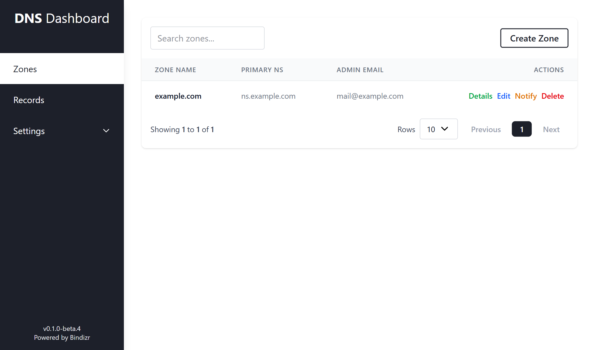

# Bindizr UI

<p>
    <a href="https://github.com/kweonminsung/bindizr-ui/actions/workflows/ci.yml">
        
    </a>
    <a href="https://github.com/netbirdio/netbird/blob/main/LICENSE">
        
    </a>
    <a href="https://github.com/kweonminsung/bindizr/releases/tag/v0.1.0-beta.5">
        
    </a>
</p>

A modern web interface for managing DNS zones and records with [Bindizr](https://github.com/kweonminsung/bindizr) backend.



## Run with Docker

```bash
$ docker run -d --name bindizr-ui -p 9000:9000 kweonminsung/bindizr-ui:0.1.0-beta.5
```

Or with Docker Compose:

```bash
$ docker compose up -d
```

Then open <http://localhost:9000>.

## Getting Started

1. **Build and install dependencies:**

   ```bash
   # Install Go dependencies
   $ go mod download

   # Install Node.js dependencies
   $ cd ui
   $ npm install
   ```

2. **Start development server:**

   ```bash
   # Start dev server(default port: 9000)
   $ GO_ENV=development go run main.go
   ```

## Dependencies

- [Go](https://golang.org/) v1.20 or higher
- [Sqlite3](https://sqlite.org/)
- [Node.js](https://nodejs.org) v20 or higher
- [React](https://reactjs.org/) v19
- [Tailwind CSS](https://tailwindcss.com/) v4
- [Bindizr](https://github.com/kweonminsung/bindizr)
