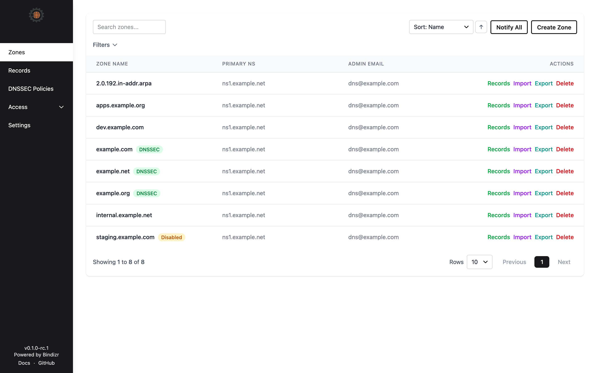
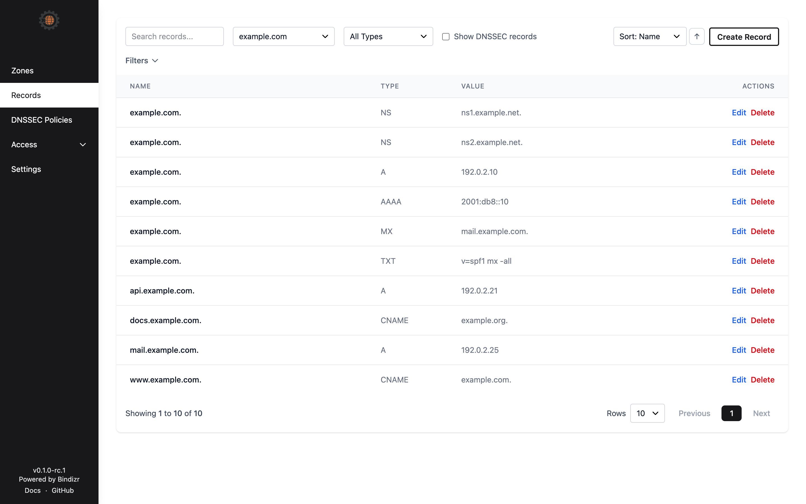
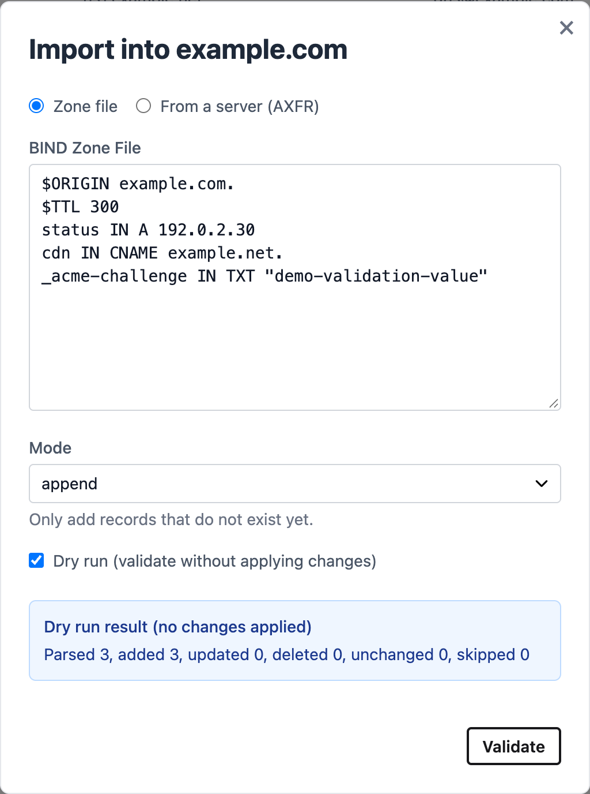
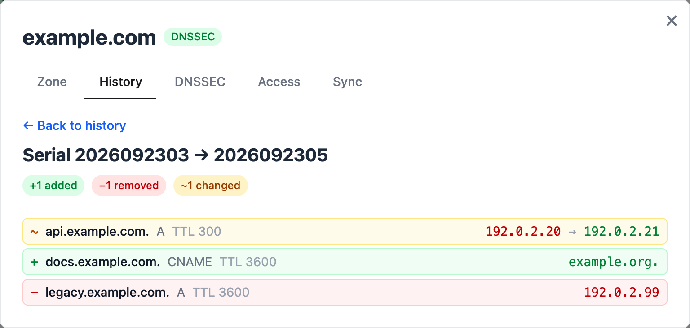
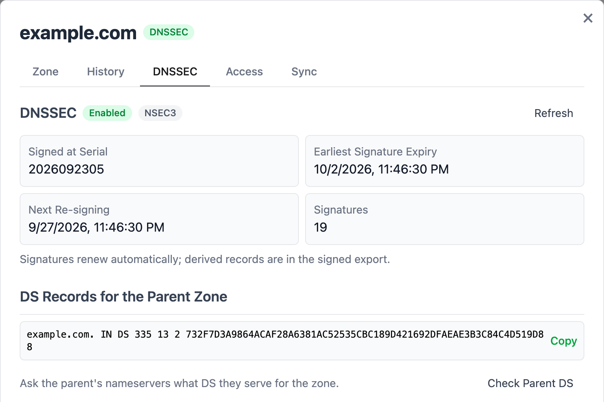
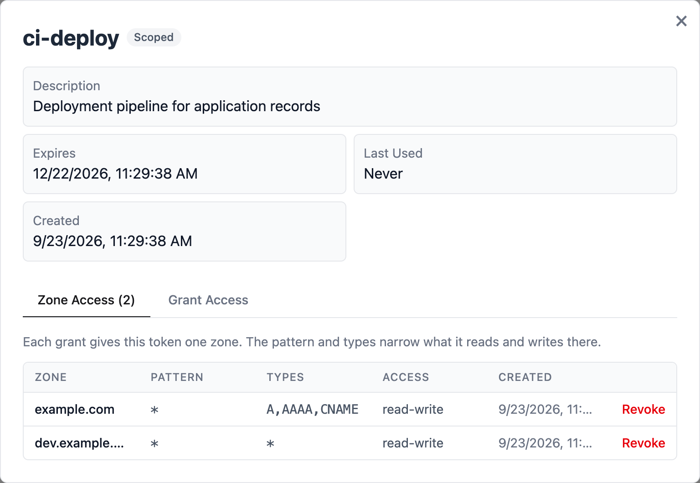
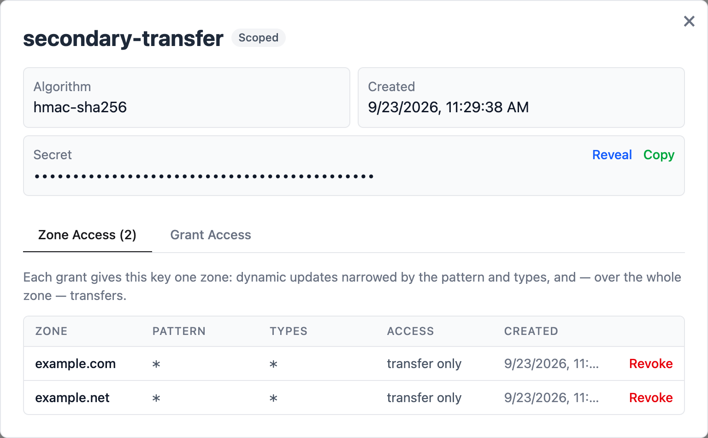
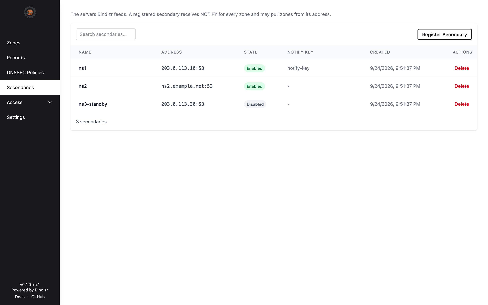

# Bindizr UI

<p>
    <a href="https://github.com/kweonminsung/bindizr-ui/actions/workflows/ci.yml">
        
    </a>
    <a href="https://github.com/netbirdio/netbird/blob/main/LICENSE">
        
    </a>
    <a href="https://github.com/kweonminsung/bindizr/releases/tag/v0.1.0-rc.1">
        
    </a>
</p>

A web interface for managing DNS zones, records, DNSSEC, and access permissions with [Bindizr](https://github.com/kweonminsung/bindizr).

[Features](#features) · [Run with Docker](#run-with-docker) · [Getting Started](#getting-started)



## Features

Screenshots show a running instance with example data.

### Zone and record management

Create and edit zones and records, configure SOA settings and TTLs, and inspect generated DNSSEC records. Search, filter, and sort listings by zone, record type, and other fields.



### Zone import and export

Import BIND zone files or transfer records over AXFR using **append**, **upsert**, or **replace**, with dry-run validation. Copy or download exports, optionally including DNSSEC records.



### Version history and rollback

Review changes by SOA serial and author, compare record differences, and preview rollbacks. Restoring a version advances the serial for secondary synchronization.



### DNSSEC signing and policies

Apply reusable signing policies, monitor signatures, and manage key rollovers. Copy DS records for the parent zone, check their publication, or trigger re-signing.



### API tokens and zone permissions

Create global or scoped tokens with optional expiry. Grant read-only or read-write access by zone, record-name pattern, and record type, and revoke grants when needed.



### TSIG keys for updates and transfers

Generate or import TSIG keys for scoped dynamic updates or whole-zone transfers. Manage zone grants and reveal or copy existing secrets when needed.



### Secondaries

Register the servers Bindizr feeds by name and address. Pause one without forgetting it, and pick a TSIG key to sign the NOTIFY it receives.



### Secondary synchronization

Check secondary serials and reachability. Send DNS NOTIFY for one or all zones, optionally bumping the serial to trigger a transfer.

## Run with Docker

```bash
$ docker run -d --name bindizr-ui -p 9000:9000 kweonminsung/bindizr-ui:0.1.0-rc.1
```

Or with Docker Compose:

```bash
$ docker compose up -d
```

Then open <http://localhost:9000>.

Run Bindizr separately. Enter its URL as reachable from the UI server, provide an API token if required, and test the connection. Optionally create a UI admin account.

A `v*` tag, or the Manual Release workflow, builds and pushes the amd64 and
arm64 image; the Publish Image workflow pushes it under a tag you enter. To
push it from your own machine instead (the tag defaults to the version in
`ui/package.json`; `IMAGE` overrides the repository):

```bash
$ ./scripts/build_image.sh
```

## Getting Started

1. **Build and install dependencies:**

   ```bash
   # Install Go dependencies
   $ go mod download

   # Install Node.js dependencies
   $ cd ui
   $ npm install
   ```

2. **Start development server:**

   ```bash
   # Start dev server(default port: 9000)
   $ GO_ENV=development go run main.go
   ```

## Dependencies

- [Go](https://golang.org/) v1.26 or higher
- [Sqlite3](https://sqlite.org/)
- [Node.js](https://nodejs.org) v20 or higher
- [React](https://reactjs.org/) v19
- [Tailwind CSS](https://tailwindcss.com/) v4
- [Bindizr](https://github.com/kweonminsung/bindizr)
